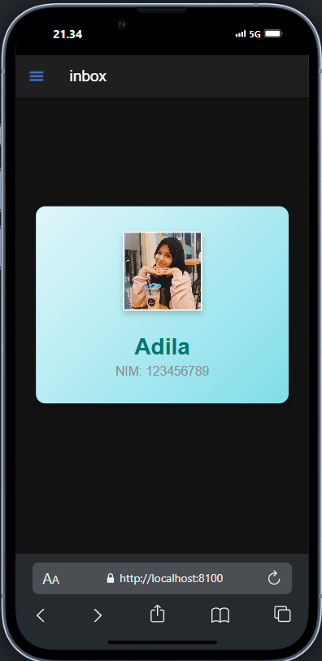

Halaman folder.page.html merupakan struktur dasar untuk membuat sebuah halaman di aplikasi Ionic dengan komponen header dan konten yang mencakup informasi profil. Bagian `<ion-header>` digunakan untuk menampilkan header aplikasi, yang memiliki properti `translucent="true"` agar tampilannya sedikit transparan. Di dalam header terdapat toolbar (`<ion-toolbar>`) yang berisi sebuah tombol menu (`<ion-menu-button>`) di sisi kiri, ditempatkan menggunakan atribut `slot="start"`. Selain itu, header juga menampilkan judul halaman (`<ion-title>`) yang dinamis, diambil dari variabel `folder` dalam komponen Angular.

Di bagian konten (`<ion-content>`), terdapat komponen header tambahan (`<ion-header collapse="condense">`) untuk mendukung efek "mengecil" saat pengguna menggulir halaman. Konten utama terdiri dari sebuah div dengan padding (`id="container"` dan kelas `ion-padding`). Di dalamnya, terdapat sebuah kartu (`<ion-card>`) yang berisi elemen profil seperti gambar persegi (`<ion-img>`), nama pengguna (`<h2>`), dan NIM (`
`). Gambar profil disesuaikan melalui atribut `src`, menunjuk ke lokasi gambar di folder `assets`. Kartu ini dirancang untuk menampilkan informasi secara terpusat menggunakan kelas `ion-text-center` pada kontennya.

## Screenshot

